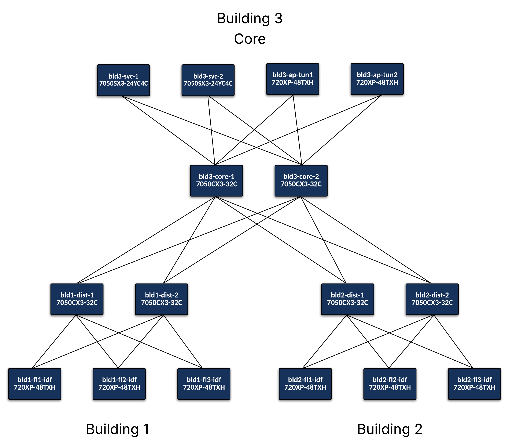

# Campus VXLAN EVPN Lab

A virtual campus network lab running Arista cEOS-Lab containers via [Containerlab](https://containerlab.dev), configured end-to-end by [Arista AVD](https://avd.arista.com/6.3/index.html) (Ansible Validated Designs). The topology models a two-building campus fabric with VXLAN/EVPN overlay, distributed L3 gateways, and ESI active-active multi-homing for shared services servers.

## Topology



### Design Summary

| Layer | Devices | Role |
|---|---|---|
| **Core (Building 3)** | `bld3-core-1`, `bld3-core-2` | BGP spines, EVPN route reflectors — underlay only, not VTEPs |
| **Distribution** | `bld1-dist-1/2`, `bld2-dist-1/2` | L3 underlay transit — not VTEPs, no EVPN participation |
| **IDF VTEPs** | `bld1-fl1/fl2/fl3-idf`, `bld2-fl1/fl2/fl3-idf` | Single-node VTEPs, per-floor L3 gateway |
| **Service VTEPs** | `bld3-svc-1`, `bld3-svc-2` | VTEPs with EVPN ESI active-active multi-homing |

**BGP design:** eBGP underlay (IDF ↔ distribution ↔ core), multi-hop eBGP EVPN overlay (IDF ↔ core, bypassing distribution layer).

### VRFs and Networks

Department VLANs are stretched across **all three floors of each building**. Every IDF VTEP carries both department VLANs for its building plus the guest VLAN, ensuring each VLAN has multiple remote VTEPs in its flood list.

| VRF | VLAN | Subnet | Gateway | Name | VTEPs |
|---|---|---|---|---|---|
| CAMPUS | 101 | 10.1.101.0/24 | 10.1.101.1 | BLD1 Marketing | All 3 Building 1 IDFs |
| CAMPUS | 201 | 10.1.201.0/24 | 10.1.201.1 | BLD1 Accounting | All 3 Building 1 IDFs |
| CAMPUS | 102 | 10.2.101.0/24 | 10.2.101.1 | BLD2 Marketing | All 3 Building 2 IDFs |
| CAMPUS | 202 | 10.2.201.0/24 | 10.2.201.1 | BLD2 Accounting | All 3 Building 2 IDFs |
| CAMPUS | 310 | 10.3.100.0/24 | 10.3.100.1 | Shared Services | bld3-svc-1/2 |
| DMZ | 255 | 10.0.255.0/24 | 10.0.255.1 | Guest/DMZ | All IDFs + bld3-svc-1/2 |

---

## Prerequisites

### 1. Docker

Install Docker Engine for your platform: https://docs.docker.com/get-docker/

Verify:
```bash
docker --version
```

### 2. Containerlab

```bash
bash -c "$(curl -sL https://get.containerlab.dev)"
```

Verify:
```bash
containerlab version
```

> This lab was validated with **Containerlab 0.72.0+**.

### 3. Arista cEOS-Lab Image

**Download** the cEOS-Lab image from [arista.com](https://www.arista.com/en/support/software-download) (requires a free account). Look for `cEOS-lab-<version>.tar.xz` under the **EOS** section.

**Import** the image into Docker:
```bash
docker import cEOS-lab-4.35.0F.tar.xz arista/ceos:latest
```

Verify:
```bash
docker images | grep ceos
```

> This lab was validated with **cEOS-lab 4.35.0F+**.

### 4. Python 3.10+

Verify you have Python 3.10 or later:
```bash
python3 --version
```

### 5. Python Virtual Environment and AVD

This repo includes `requirements.txt` (Python packages) and `requirements.yml` (Ansible Galaxy collections) pinned to the validated versions. Use the provided `make setup` target to create an isolated environment:

```bash
make setup
```

This command:
1. Creates a `.venv/` virtual environment in the project directory
2. Installs all Python dependencies (`ansible-core`, AVD requirements, etc.)
3. Installs all Ansible Galaxy collections (`arista.avd`, `ansible.netcommon`, `arista.eos`)

The Makefile automatically detects the `.venv/` directory and uses it for all `make build`, `make deploy`, and `make validate` commands — no manual activation required.

If you prefer to activate the venv manually:
```bash
source .venv/bin/activate
ansible-galaxy collection list | grep arista.avd   # verify
deactivate
```

> This lab was validated with **AVD 6.3.0** and **ansible-core 2.15+**.

---

## Management Network

All devices share a management network (`172.100.100.0/24`) created automatically by Containerlab. This network is the gateway for SSH and eAPI access.

| Device | Management IP |
|---|---|
| bld3-core-1 | 172.100.100.2 |
| bld3-core-2 | 172.100.100.3 |
| bld1-dist-1 | 172.100.100.11 |
| bld1-dist-2 | 172.100.100.12 |
| bld2-dist-1 | 172.100.100.13 |
| bld2-dist-2 | 172.100.100.14 |
| bld1-fl1-idf | 172.100.100.21 |
| bld1-fl2-idf | 172.100.100.22 |
| bld1-fl3-idf | 172.100.100.23 |
| bld2-fl1-idf | 172.100.100.24 |
| bld2-fl2-idf | 172.100.100.25 |
| bld2-fl3-idf | 172.100.100.26 |
| bld3-svc-1 | 172.100.100.31 |
| bld3-svc-2 | 172.100.100.32 |

### Credentials

| Username | Password | Use |
|---|---|---|
| `admin` | `admin` | SSH interactive access |
| `arista` | `arista` | AVD eAPI deployment |

---

## Lab Workflow

All commands are run from this directory.

### Start the Lab

```bash
make start
```

Deploys all 14 cEOS containers and 8 Linux hosts using Containerlab. Allow **3–5 minutes** for all containers to reach a running state.

Check status:
```bash
make inspect
```

Wait until all nodes show `running` before proceeding.

### Connect to a Device

```bash
ssh admin@<hostname>     # e.g. ssh admin@bld3-core-1
# or by IP:
ssh admin@172.100.100.2
```

Password: `admin`

### Build AVD Configurations

Generates EOS configs and documentation into `avd/intended/` and `avd/documentation/`. Runs locally — devices do not need to be reachable.

```bash
make build
```

Review a generated config:
```bash
cat avd/intended/configs/bld1-fl1-idf.cfg
```

### Deploy Configurations

Pushes the generated configs to all devices via eAPI (HTTPS). Devices must be running and reachable first.

```bash
make deploy
```

### Validate the Fabric

Runs ANTA (Arista Network Test Automation) tests against all devices and saves reports to `avd/anta/reports/`.

```bash
make validate
```

### Stop the Lab

Destroys all containers and frees resources. The `--cleanup` flag removes the management bridge as well.

```bash
make stop
```

---

## Full Bring-Up Sequence

```bash
make setup      # 1. Create venv and install Python/Ansible dependencies (once)
make start      # 2. Deploy containers (~3-5 min wait)
make inspect    # 3. Verify all nodes are running
make build      # 4. Generate EOS configs from AVD data models
make deploy     # 5. Push configs to devices via eAPI
make validate   # 6. Run ANTA health checks
```

---

## VS Code Containerlab Extension (Topology Viewer)

The [Containerlab VS Code Extension](https://marketplace.visualstudio.com/items?itemName=srl-labs.vscode-containerlab) provides an interactive graphical topology viewer directly inside VS Code — useful for visually navigating the lab, opening SSH sessions, and capturing packets without touching the CLI.

### Installation

1. Open VS Code
2. Open the Extensions panel (`Ctrl+Shift+X` / `Cmd+Shift+X`)
3. Search for **Containerlab** (publisher: `srl-labs`)
4. Click **Install**

Or install from the command line:
```bash
code --install-extension srl-labs.vscode-containerlab
```

### Opening the Topology Viewer

After `make start`:

1. Click the **Containerlab** icon in the VS Code Activity Bar (left sidebar)
2. Your running lab (`sandbox`) will appear under **Local**
3. Click the lab name or the **TopoViewer** icon to open the interactive topology diagram

The viewer renders the full topology graph with live node status. Nodes that are running appear active; nodes that are down are visually distinguished.

### SSH to a Node

Right-click any node in the topology viewer and select **SSH** — this opens a new VS Code terminal with an SSH session to that device already established.

Alternatively, right-click and select **Console** for direct console access to the container.

### Packet Capture

Right-click any **link** between two nodes and select the **Wireshark** icon. Containerlab streams the capture directly to Wireshark on your local machine, letting you inspect VXLAN-encapsulated frames on the underlay or raw frames on the access ports in real time.

> Wireshark must be installed locally and `wireshark` must be in your `PATH` for remote capture to work.

### Useful Shortcuts

| Action | How |
|---|---|
| Open topology viewer | Click Containerlab icon in Activity Bar → select lab |
| SSH to a node | Right-click node → SSH |
| Console access | Right-click node → Console |
| Packet capture on a link | Right-click link → Wireshark icon |
| Start/stop lab from VS Code | Right-click lab name → Deploy / Destroy |

---

## AVD Data Model Structure

```
avd/
├── inventory.yml                          # Ansible inventory / group hierarchy
├── group_vars/
│   ├── CAMPUS_FABRIC.yml                 # Global: BGP protocols, AAA, NTP, credentials
│   ├── CAMPUS.yml                        # DC-level: mgmt gateway, MTU
│   ├── CAMPUS_SPINES.yml                 # Core switches (AS 65100)
│   ├── CAMPUS_DIST.yml                   # Distribution switches (underlay transit only)
│   ├── CAMPUS_IDF_VTEPS.yml              # IDF VTEPs (AS 65101–65106)
│   ├── CAMPUS_SVC_VTEPS.yml              # Service VTEPs (AS 65301–65302, ESI)
│   ├── CAMPUS_NETWORK_SERVICES.yml       # VRFs, VLANs, SVIs
│   └── CAMPUS_ENDPOINTS.yml             # Host and server port profiles
└── playbooks/
    ├── build.yml
    ├── deploy.yml
    └── validate.yml
```

To modify the fabric, edit the relevant `group_vars/` file and re-run `make build && make deploy`.

---

## Useful Verification Commands

Run these on any EOS device after deployment:

```eos
! Underlay BGP
show ip bgp summary

! EVPN overlay sessions (should show Estab to both cores)
show bgp evpn summary

! EVPN routes (Type-2 MAC/IP and Type-5 IP prefix)
show bgp evpn route-type ip-prefix
show bgp evpn route-type mac-ip

! Per-VRF routing table
show ip route vrf CAMPUS
show ip route vrf DMZ

! VXLAN VNI mappings
show vxlan vni
show vxlan address-table

! Interface status
show interfaces vxlan1
show ip interface brief
```

---

## Troubleshooting

**Containers not reachable after `make start`**
cEOS can take 2–3 minutes to fully boot and load startup configs. Run `make inspect` repeatedly until all nodes show `running`, then wait an additional 60 seconds before deploying.

**`make deploy` fails with authentication errors**
The `arista` user (password `arista`) must exist on the device. This is configured by the init-configs in `clab/init-configs/`. If a node was restarted without its init-config, SSH to it as `admin` and verify `show running-config | section username`.

**`make build` fails with schema validation errors**
Ensure AVD 6.x is installed. Earlier versions have different schemas. Run `ansible-galaxy collection list | grep arista.avd` to verify.

**Cross-VLAN pings fail from Linux hosts**
Verify the host has a route for `10.0.0.0/8` via its data interface: `ip route show`. The `STATIC_ROUTE: 10.0.0.0/8` env var in the topology configures this automatically on start.
